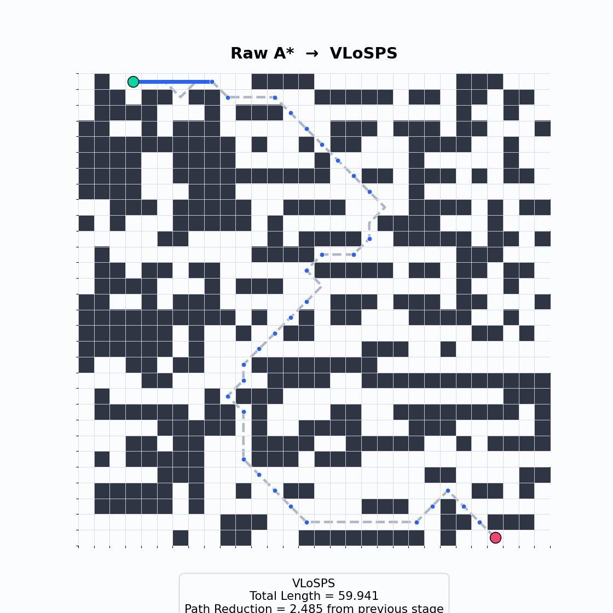
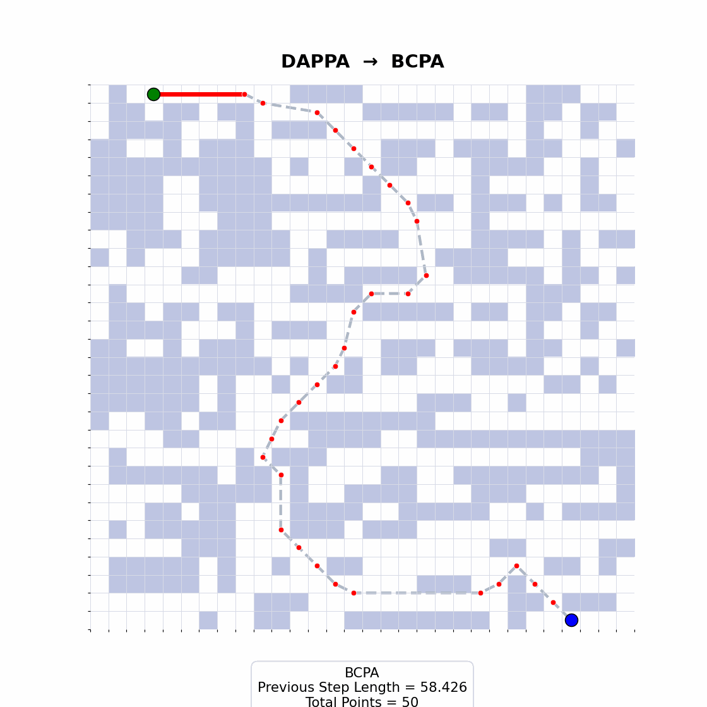
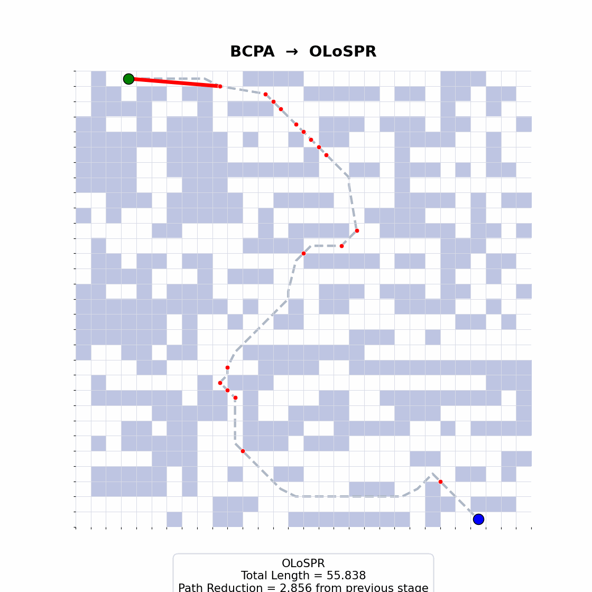
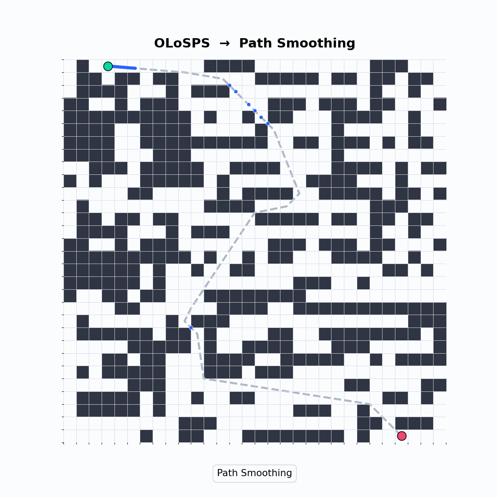
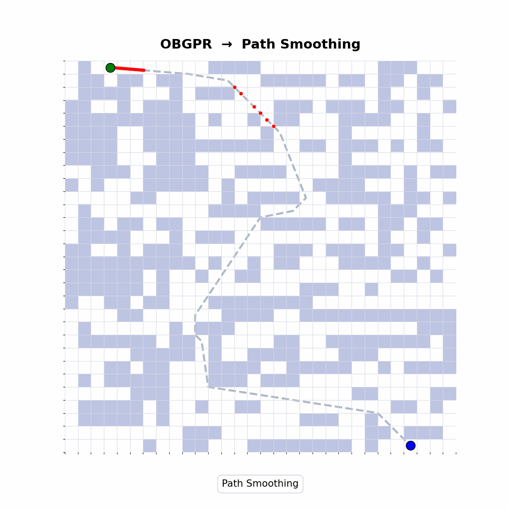
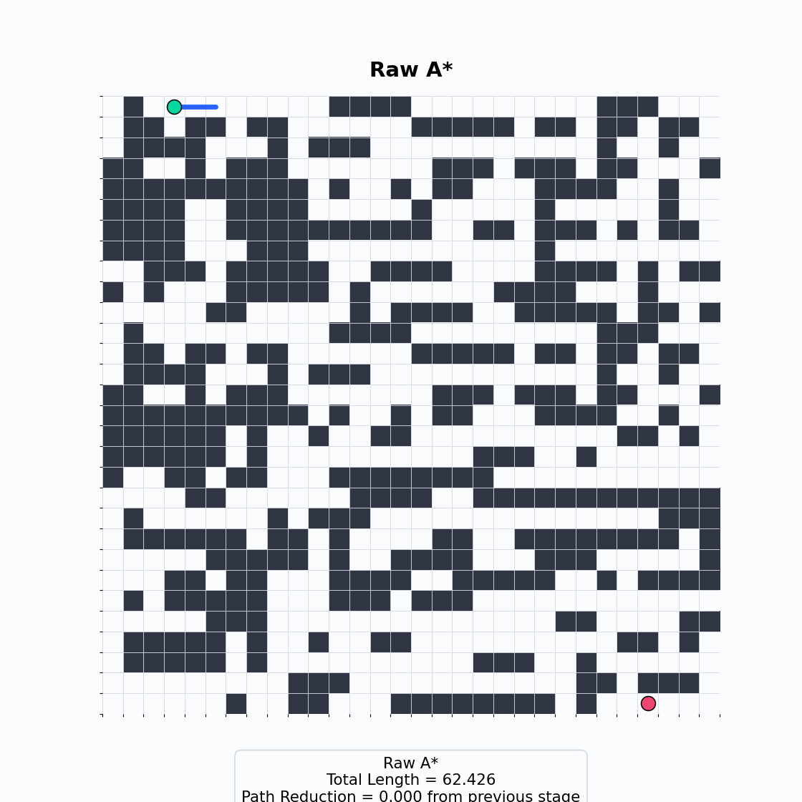

# SBCR-A*: Supercover-Based Corridor Reconstruction for Optimal Path Length in Grid-Based Navigation

SBCR-A* is an improved A* reconstruction method that produces a compact sequence of straight, collision-free path segments using supercover-based line-of-sight (LOS) validation and obstacle-boundary-guided refinement.

## Overview

Grid-based planners such as **A\*** are widely used in robotics and autonomous navigation because many environments can be discretized into **binary occupancy grids**, guaranteeing a solution whenever a collision-free path exists. In practice, however, standard grid search often produces paths with **redundant waypoints**, **unnecessary turns**, and **stepwise motion artifacts**, which increase traversal time, energy consumption, and control effort. **SBCR-A\*** is a new A\*-based approach that integrates supercover line-of-sight validation and obstacle-boundary-guided refinement to reduce waypoint redundancy and produce a compact sequence of **straight** segments with improved **path-length optimality**, while preserving collision-freedom under a conservative occupancy-grid map.

## Repository structure

```text
SBCR_ASTAR_REPRO/
├── README.md
├── requirements.txt
├── run_pipeline_notebook_style.py
├── assets/
│   └── gifs/
│       ├── 01_full_pipeline.gif
│       ├── 02_raw_aastar_to_vlosps.gif
│       ├── 03_vlosps_to_dappa.gif
│       ├── 04_dappa_to_bcpa.gif
│       ├── 05_bcpa_to_olospr.gif
│       ├── 06_olospr_to_obgpr.gif
│       └── 07_obgpr_to_path_smoothing.gif
├── data/
│   ├── __init__.py
│   └── demo_grids.py
├── datasets/
│   ├── maze-images-dataset
│   ├── modified-ISPRS-urban-segmentation-dataset
│   ├── modified-semantic-segmentation-of-aerial-imagery-dataset
│   └── modified-uavid-dataset
├── classical_planners/
│   ├── __init__.py
│   ├── common.py
│   ├── AStar.py
│   ├── BFS.py
│   ├── DFS.py
│   └── Dijkstra.py
├── stages/
│   ├── __init__.py
│   ├── VLoSPS.py
│   ├── DAPPA.py
│   ├── BCPA.py
│   ├── OLoSPR.py
│   └── OBGPR.py
├── smoothing/
│   ├── __init__.py
│   ├── bezier_curve.py
│   ├── rational_quadratic_bezier_curve.py
│   └── bspline_smooth.py
└──utils/
    ├── __init__.py
    ├── path_metrics.py
    └── path_processing.py
```

## Folder purpose

### `stages`
This folder contains the four path refinement stages used in the structured pipeline.

- `VLoSPS.py` implements the visibility based path simplification stage
- `DAPPA.py` implements the direction aware path point adjustment stage
- `BCPA.py` implements the boundary contact path augmentation stage and includes the obstacle corner contact generation logic
- `OLoSPR.py` implements the omnidirectional line of sight refinement stage and includes `_cells_on_segment_supercover_dda` for supercover based cell traversal along path segments
- `OBGPR.py` implements the obstacle-boundary-guided path refinement stage

### `classical_planners`
This folder contains classical graph search baselines.

- `AStar.py`
- `BFS.py`
- `DFS.py`
- `Dijkstra.py`

These planners can be used independently or as alternative front ends for the refinement pipeline.

### `smoothing`
This folder contains the curve generation and continuous path smoothing functions.

- `bezier_curve.py`
- `rational_quadratic_bezier_curve.py`
- `bspline_smooth.py`

The helper `get_intermediate_quadratic_bezier_curve_points` is included in `bezier_curve.py` because it orchestrates the local quadratic smoothing process used in the final stage.

### `utils`
This folder contains supporting utilities used across the repository.

- `path_metrics.py` contains functions for total path length computation, removal of near duplicate points, removal of collinear points, and verification of whether a path segment is collision free.
- `path_processing.py` contains path densification

### `data`
This folder contains the demo grids and the start destination point sets copied from the notebook so the repository can be executed without reconstructing them manually.


## Algorithmic pipeline

### 1. Raw A Star
The baseline planner computes a feasible collision free path on the binary occupancy grid. This path is discrete and grid constrained, and therefore serves as the reference trajectory for all subsequent stages.

### 2. VLoSPS
VLoSPS removes redundant intermediate grid points along visible horizontal and vertical free runs. This reduces unnecessary waypoint density while preserving feasibility on the discrete map.

<!--  -->


### 3. DAPPA
DAPPA adjusts selected turning points using local directional structure. This step introduces half cell offsets when the local geometry supports a safer and smoother directional transition.

<!--  -->


### 4. BCPA
BCPA augments the path by inserting obstacle boundary contact points at diagonally relevant local configurations. This does not aim to reduce path length directly. Instead, it enriches the path representation near obstacle boundaries, which the subsequent line of sight refinement stage has a more informative geometric structure to operate on.

<!--  -->


### 5. OLoSPR
OLoSPR performs omnidirectional line of sight refinement on the augmented path. The implementation includes `_cells_on_segment_supercover_dda`, every candidate shortcut is checked through supercover traversal of the cells touched by the segment. This makes the shortcut validation more conservative and more geometrically meaningful near obstacle boundaries.

<!--  -->


### 6. OBGPR
OBGPR refines the reconstructed path by using the free corridor defined along obstacle boundaries. It replaces redundant intermediate waypoints with longer feasible corridor-aligned segments whenever safe boundary-guided connection is possible.


### 7. Path Smoothing
The final stage densifies the refined polyline and applies path smoothing. This stage is intended to improve geometric continuity and visual smoothness while preserving the high level path structure obtained after OLoSPR.

<!--  -->


## Full stage evolution

<!--  -->


## This script executes the following sequence

1. Load `grid_data`, `src_points`, and `dest_points`
2. Run `a_star_search` or any other path planning algorithm
3. Run `VLoSPS`
4. Run `DAPPA`
5. Run `BCPA`
6. Run `OLoSPR`
7. Run `OBGPR`
8. Densify the path
9. Generate the quadratic or rational quadratic or B-spline smoothing output

## Citation

**Authors**  
Isuru Munasinghe∗  
Charitha Dombawala∗  
Asanka Perera†
Sreenatha Anavatti‡  
Matt Garratt‡  

**Affiliations**  
∗ Department of Electronic and Telecommunication Engineering, University of Moratuwa, Katubedda, Sri Lanka  
† School of Science, Engineering and Digital Technologies, University of Southern Queensland, Brisbane, Australia  
‡ School of Engineering and Technology, University of New South Wales, Canberra, Australia

Please kindly cite the following paper appropriately when using this repository, its methodology, or any derived results in academic publications or related scholarly work.

⚠️ **Note:** The associated paper describing this work is currently under review.